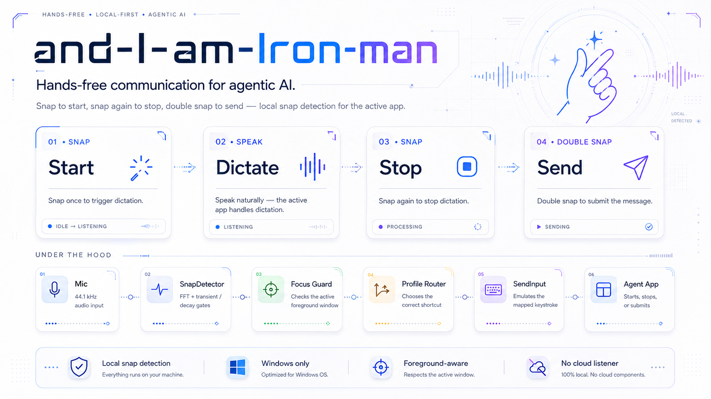

# Snap-To-Dictate

The repository is named `and-I-am-Iron-Man`. The tool inside it is called
Snap-To-Dictate. One name is the idea and the other is what it does, and they
are the same project.

**Snap your fingers to start dictating. Snap again to stop. Snap twice to
send.**

Claude, ChatGPT, Codex and the rest all take voice input, and every one of them
hides it behind a keyboard shortcut. Ctrl+D here, something else there. So
"voice input" still means reaching for the keyboard to start, reaching for it
again to stop, and reaching a third time to send. You end up typing in order to
avoid typing, and the one thing voice was supposed to buy you, keeping your
hands where they already were, is exactly what you hand back.

This is the button those apps do not have. A snap starts dictation in whatever
window is in front of you. Another snap stops it. Two quick snaps stop it and
submit. A whole prompt goes out without your hands touching anything.

That is worth the most when the keyboard is the awkward part of the room:

- dictating something long, where the reach for a shortcut is the thing that
  breaks your train of thought
- sitting or pacing on the other side of the room, because that is where you
  think best
- cooking, holding a baby, on a treadmill, hands already full of something else
- any reason a keyboard costs you more than it costs other people, an RSI, a
  tremor, limited reach

Why a snap and not a wake word. A snap is a sharp broadband transient. It is
loud in exactly the band a quiet room is not, it still registers from across
the room, and identifying one needs no speech recognition at all. There is no
phrase to be misheard, no transcriber running all day, no cloud service and no
account. Nothing leaves the machine, because there is nothing here that could
send it. The whole decision is a handful of numbers computed from each 5.8 ms
block of audio, and the audio itself is only written to a file when you ask for
one.

The honest scope. Windows only. And it does not do the dictating. It presses
your own app's dictation shortcut for you, choosing which shortcut by looking
at which window has focus, so it drives whatever is in front of you rather than
one hard-wired app. A window it does not recognise gets nothing at all.

| Gesture | What happens |
|---|---|
| **Snap** | dictation starts recording |
| **Snap again** | dictation stops. Nothing is sent. |
| **Snap twice, quickly** | dictation stops, then the message is submitted |

You never touch the keyboard. Every state has exactly one snap leading out of
it, so a snap is never ambiguous and you can never get stuck. See
[The three states](#the-three-states).

Under the hood the job splits in two:

1. A background listener watches the mic for a finger snap.
2. When it hears one, it presses that app's dictation key into whichever window
   is in front.

A logon scheduled task starts the listener. It then sits idle with the
microphone closed until one of the wired apps is actually running. See
[Autostart at logon](#autostart-at-logon).

Windows only. It is built on `SendInput` and the Win32 foreground window API.

---

## Setup

### 1. Install the dependencies

```bash
pip install -r requirements.txt
```

Two packages, both wheels. Python 3.8 or newer.

### 2. Check the install worked

```bash
python snap_to_dictate.py --verify
```

Fifteen checks. It opens the microphone for real rather than just reading the
device list, because a device can be listed and still refuse to open. It exits
0 when the tool can work and non-zero when it cannot.

The output is three kinds of line. **FAIL** means it will not work until you
fix that. **WARN** means it works, but something you chose is worth a look, like
no listener running yet. **OK** means checked and good, never assumed.

It presses no keys, so it is safe to run at any time.

### 3. Confirm the process name of the app you want

```bash
python snap_to_dictate.py --whoami
```

Click the window you want to check during the countdown. It reports the process
name, the window title, which profile claims that window, and what a snap there
would actually send. If nothing claims it, it prints the two lines you need to
paste into `config.json`.

### 4. Watch it before letting it type

```bash
python snap_to_dictate.py --dry-run
```

Snap, type, talk, move your chair. Every detection is logged with its peak
level, noise floor, brightness and decay time, but no key is sent. Adjust
`config.json` until only real snaps say `TRIGGER`.

### 5. Calibrate, if the defaults do not fit you

The shipped `config.json` is already tuned from labelled recordings, but they
were made in one room, on one microphone, by one person. Skip this step if
snaps are landing and nothing false is getting through. Do it if either of
those stops being true. A different mic, a different room or a different
snapping hand is the usual reason.

```bash
python snap_to_dictate.py --calibrate
```

Seven guided passes, about four minutes of recording and five minutes of your
time. It derives four settings, checks the result against six acceptance tests,
and writes a new config only if all six pass. If any fail, your old config is
left exactly as it was and the recording is kept so a fix can be re-run against
it. [CALIBRATION.md](CALIBRATION.md) explains what each pass measures and why.

### 6. Run it

```bash
python snap_to_dictate.py
```

Or `run.bat`, which launches it minimised. To have it start at logon instead,
see [Autostart at logon](#autostart-at-logon).

---

## What you must supply yourself

Four things in this repository came off one machine, in one room, and none of
them transfers on its own. What is shipped is a worked example rather than a
default that is correct everywhere. Each row is a thing you have to find for
yourself before the tool will behave.

| The thing | How to find yours | What breaks if it is wrong |
|---|---|---|
| **Your app's dictation shortcut** | The app's own settings, or its keyboard shortcut list. Nothing in this repository can tell you, because the shortcut belongs to the app and moves between releases. Once you have a candidate, confirm it against the real window with `--test-key --key ctrl+shift+v`. | The key still gets pressed. It just fires whatever the app really has bound there, in a window you are looking at. That is the failure the whole routing table exists to prevent, so never enable a profile on a shortcut nobody has confirmed. The one key that ships armed without your confirmation is the catch-all's `ctrl+space`, for the reasons under *Every other app, through Windows itself*; confirm that one after the fact, and turn it off if it does nothing on your machine. |
| **The process name of each app you want** | `--whoami`, then click that window during the countdown. It prints the process name, the window title, which profile claims the window, and what a snap there would send. | A profile naming an image that does not exist on your machine matches nothing, so every snap in that window is ignored and `snap.log` marks it `skipped`. Install method changes the name, so a Microsoft Store package and a direct download need not agree. |
| **Your microphone** | `--list-devices`, then put that index in `device` in `config.json`. | The listener opens an input that cannot hear you and nothing in `snap.log` explains it beyond an absence of detections. |
| **Your detection thresholds** | `--calibrate`, or tune by hand against `--dry-run`. The shipped `config.json` was tuned in one room, on one microphone, from one person's snap. | Too tight and real snaps are dropped silently, which reads as "it works sometimes". Too loose and a keystroke near the mic can send a message you never wrote. |

Once all four are in place, `--verify` checks the install end to end and exits
non-zero if it cannot work.

---

## Which apps it drives

The window in front decides what a snap means. `config.json` carries a list of
`profiles`, and the first one whose process **and** title both match wins.

```json
{"name": "Claude desktop", "process": "claude.exe", "title": null,
 "mode": "dictation", "activate": "ctrl+d", "send": "enter", "enabled": true}
```

What is wired out of the box:

| Window | Matched by | Gesture | Sends |
|---|---|---|---|
| Claude desktop | `claude.exe` | snap on, snap off, snap twice submits | `ctrl+d`, then `enter` |
| Codex | `chatgpt.exe` plus `^Codex` | snap on, **snap twice** off | `ctrl+b`, then `ctrl+b` |
| ChatGPT | `chatgpt.exe` plus `^ChatGPT` | snap on, **snap twice** off | `ctrl+b`, then `ctrl+b` |
| Antigravity | `antigravity.exe` | snap on, snap off, snap twice submits | `ctrl+m`, then `enter` |
| Antigravity IDE | `antigravity ide.exe` | none | nothing, deliberately |
| VS Code | `code.exe` | none | nothing, deliberately |
| Anything else | nothing claims it, so the catch-all does | snap on, snap off, snap twice submits | `ctrl+space` through Windows, then `enter` |
| 33 named processes | terminals, Explorer, the lock screen, Remote Desktop, editors where `ctrl+space` is autocomplete, the Start menu, search, UAC and password prompts | none | nothing, ever |

**Treat *Matched by* and *Sends* as this machine's answers, not yours.** The keys
were the right ones for the app versions installed here on the day they were
written, and an app is free to move its dictation shortcut in any release. The
image names are what those apps were called here, and an installer can change
that too. Check the process name with `--whoami` and the key with `--test-key`
before you rely on either.

Antigravity IDE and VS Code sit in that table with no key of their own on
purpose, and they still work; a profile that cannot press anything falls
through to the catch-all rather than doing nothing.

For a long time a window that matched nothing was simply ignored, and that
narrowness *was* the safety mechanism. The catch-all trades it for a smaller and
sharper one: a named list of windows the tool refuses to type into at all. The
reason a guard has to exist has not changed. Ctrl+D is the Claude app's
dictation toggle, but it is also **end of input in every terminal**, and it is
how the Claude Code CLI quits. Twice within 800 ms and the session is gone. The
listener fires on a *sound*, and a sound has no idea what has focus.

An earlier version allowed terminals, back when the key was Alt+K and harmless.
That would now turn a false positive into a lost session. `test_detector.py`
asserts that no terminal matches any profile, and `--verify` checks the same
thing against your live config.

### Every other app, through Windows itself

Wiring an app up means finding its dictation shortcut, and most apps do not
have one. Windows does. It has its own dictation that works in any window that
takes text, and it needs no per-app setup, so an app nobody has wired is not
out of reach. Press the system key instead of an app key and the same gesture
works everywhere.

That is the `fallback` block in `config.json`, and it applies to any window no
profile claimed:

```json
"fallback": {"name": "Windows voice typing", "mode": "dictation",
             "activate": "ctrl+space", "send": "enter", "enabled": true}
```

Snap once to start, snap again to stop, snap twice to submit. The same three
gestures, in Chrome, in Word, in Slack, in an IDE, in anything.

**Check the key before you trust it.** It ships as `ctrl+space` because that is
what worked on the machine this was written on. Windows' own documented
voice-typing shortcut is `win+h`, and on some machines `ctrl+space` is bound to
an input-method switch instead. Confirm yours with `--test-key` first. A wrong
key here matters more than a wrong key anywhere else in this file, because this
one reaches every app rather than one.

An app that has a profile but no key of its own uses the catch-all too. That is
why Antigravity IDE and VS Code work now: their own dictation shortcuts are
missing or wrong, which is exactly the case the system-wide key covers.

### The apps it refuses to touch

Every other profile names the window it may type into. This one names nothing,
so its safety is a list rather than a match, and the list exists because of the
send. A double snap presses Enter, and Enter is not a harmless key everywhere:

| Window | What Enter does there |
|---|---|
| any terminal | runs whatever is on the command line |
| `explorer.exe` | opens whichever icon happens to be selected, and the desktop is the foreground window whenever nothing else is |
| `consent.exe` | the UAC prompt, where Enter is Yes |
| `LogonUI.exe`, `CredentialUIBroker.exe` | the lock screen and credential dialogs, where keystrokes go into a password box |
| `Taskmgr.exe` | End Task on whatever is selected |
| `StartMenuExperienceHost.exe` | launches whichever app is highlighted in the Start menu |
| `SearchHost.exe`, `SearchApp.exe` | runs the top search result |
| `ShellExperienceHost.exe` | activates whatever notification or shell surface is focused |
| `TextInputHost.exe` | the emoji picker, the touch keyboard and the voice typing panel itself, which is input UI rather than somewhere to put input |

Twenty-two processes are refused outright. A window whose process cannot be
identified is refused as well, because a window that cannot be named cannot be
vouched for, and "cannot be named" covers more than an empty string. When there
is no foreground window at all, when the session is locked, or when the window
belongs to an elevated process, the tool records *why* it could not identify it
and that description is not an application name. Those are refused too.
`--verify` checks the list rather than trusting it, and the test suite reads the
descriptions out of the source so a new one is covered the day it is added.

Extend the list rather than cutting it down. An app wrongly left out gets no
dictation and says so in the log. An app wrongly let in gets a keystroke nobody
asked for.

One more thing keeps it honest. Each unwired app resolves under its own name,
`Windows voice typing [chrome.exe]`, so the log tells you which window a snap
came from rather than lumping every unwired app into one line.

Those names share one **session**, though, and the focus re-check compares the
session rather than the name. That distinction matters. Windows
voice typing is a single panel for the whole desktop, not one dictation per app,
so alt-tabbing does not start a new one. If the tool treated the move as a fresh
dictation it would press `ctrl+space` believing it was opening the panel, when
what that actually does is close the panel already open, and every reading after
that would be inverted: the log saying ON while the microphone is off. The name
answers "may this keystroke land here". The session answers "is this the same
dictation". They are not the same question.

To turn the whole thing off, set `"enabled": false` on the `fallback` block, or
clear its `activate`. Either one silences every unwired app.

### A snap that finds a new window is spent finding it

Move to a different app mid-dictation and the first snap over there does one
thing only: it drops the state that belonged to the old window and says so. It
does not also start anything. For one commit it did both, because the branch
that dropped the state carried on into the code that presses keys, and with the
state now clear that code read the snap as "start". One snap turned Claude's
dictation off and Codex's voice agent on, and the log recorded both on the same
second.

The second thing that changed with it: the window has to hold still. Windows
answers "what is in front" for the instant you ask, and plenty of windows own
the foreground for a few dozen milliseconds without you ever looking at them, a
chat client jumping forward when a reply lands being the ordinary case. The
answer is read twice now, sixty milliseconds apart, and a snap that arrives
while the answer is changing is ignored with a line in the log rather than
aimed at a guess.

### An app with a profile is never the catch-all's business

The catch-all is for processes nobody has an opinion about. Writing a profile is
an opinion, so naming a process in the table takes it away from the catch-all
for good. Not "unless the title fails to match", and not "unless the profile has
no key" - for good.

Both of the other readings shipped, and both were reported as bugs on 23 August
2026, in the same message.

**A title that missed used to fall through.** The Codex profile matched
`chatgpt.exe` with the anchored title `^Codex$`. The moment the ChatGPT desktop
app appended a project name to its window, the regex missed, `chatgpt.exe` fell
past the profile, and `ctrl+space` was pressed into Codex. The anchor is looser
now (`^Codex`, so a suffix costs nothing) but that is the small half of the fix.
The large half is that a miss no longer reaches the catch-all at all - the snap
is ignored and the log says which window it was ignored in.

**A profile with no key used to fall through.** Antigravity IDE and VS Code are
listed precisely because nobody has confirmed their dictation shortcut. That was
read as "no shortcut of its own, so use the system one". `snap.log` counted 47
catch-all keystrokes into `antigravity ide.exe` in a single day. A profile with
no key is a statement that this app is known and must be left alone, not an
invitation to guess one.

**The corollary is the escape hatch.** To keep the catch-all out of any app,
give it a profile naming its process with `"enabled": false`. No code change:

```json
{"name": "Notepad", "process": "notepad.exe", "title": null,
 "mode": "dictation", "activate": null, "send": null, "enabled": false}
```

**Explorer is refused outright now.** For one commit it was split by title, so
that folder windows got the gesture and the desktop and the alt-tab switcher did
not. Dictation turning itself on in the file manager is not something anybody
asked for, and it was reported as a bug the same day it shipped. Enter in
Explorer opens whichever icon is selected, which was always the stronger
argument. The title rule is gone rather than left in place as a guard that no
longer guards anything.

**The Start menu, the search box and the input panel are not Explorer.** They
look like shell windows and it is tempting to name them by title under
`explorer.exe`. They are their own processes: `StartMenuExperienceHost.exe`,
`SearchHost.exe`, `SearchApp.exe`, `ShellExperienceHost.exe` and
`TextInputHost.exe`. Written as Explorer titles they would never match, so the
guard would read as covering them while every one of them fell through. That
happened. Check which process owns a window before writing a rule about it.

### What Windows voice typing actually is

The catch-all leans on one Microsoft feature, so it inherits that feature's
behaviour, limits and all. What is worth knowing before you rely on it:

- **It is cloud speech recognition.** The audio goes to Microsoft's servers and
  the words come back. No internet, no dictation, and there is always a lag
  between stopping and the text appearing.
- **`win+h` is the documented shortcut.** `ctrl+space` ships here because that
  is what worked on the machine this was written on. It is not a Windows
  default, so confirm it with `--test-key`, and change it to `win+h` if yours
  does nothing.
- **It pauses itself after roughly five to ten seconds of silence**, and
  Microsoft does not expose a setting for that. It also stops when the internet
  drops, when you click into another window, and when you start typing on the
  keyboard.
- **It is one panel for the whole desktop**, not one dictation per app. It types
  into whatever has focus when the words arrive. That is the reason every
  unwired window shares one session here.
- **It understands spoken commands**, "Press Enter" among them, along with
  "Stop listening", "Delete that", "Select that" and "Undo that". Dictation
  commands are US English only. "Press Enter" does the same job as the double
  snap, out loud, and it works when your hands are nowhere near the machine.
- **Auto-punctuation and microphone choice** live behind the gear icon on the
  panel, not in Settings.
- **Voice Access is a different feature.** `win+h` dictates. Voice Access
  controls the whole PC and works offline. If hands-free is the goal rather
  than dictation specifically, that is the one to go and read about.

### What actually makes a double snap send

The send used to be a race, and it lost most of the time. A full day of
`snap.log` has the score: **141 stops in Claude desktop, 35 sends, 106 restarts,
and 55 of those restarts abandoned within three seconds** because a send was
what had been asked for. The message the user meant to submit stayed in the
composer and the microphone opened again instead.

The obvious fix was to widen the window, and the same log says it does not work.
Measured across every stop in the file, at each width, the sends a wider window
recovers against the deliberate restarts it destroys:

| window | sends recovered | real restarts turned into an unwanted Enter |
|---|---|---|
| 0.75 s | 0 | 0 |
| 1.5 s | 11 | 9 |
| 2.5 s | 19 | 19 |
| 3.5 s | 23 | 30 |

There is no width that wins, because "I want to send this" and "I want to start
again" are the same gesture at the same speed. A clock cannot separate them.

**The pair can.** Every send that ever worked came from a snap that arrived
while the stop was still *held* - the beat between the snap and the keystroke
during which the tool checks whether the room actually went quiet. That hold
used to end the instant the question could be answered, about 300 ms in. A
natural double snap lands 76 to 989 ms after the first, so the confirming snap
was usually still in the air when the stop was pressed, and what happened to it
afterwards depended on timing nobody controls.

The hold now waits out the whole pair window before pressing the stop. A second
snap inside it is the send, deterministically, with the pair itself as the
evidence rather than a clock. It costs about 600 ms of extra recording, which is
the cheapest thing in this document.

One more thing had to go with it. The held stop also runs a silence check, which
asks whether the room went quiet just after the snap and drops the stop if it
did not. The confirming snap arrives inside the exact stretch that check
measures, so a deliberate double snap was making the room loud and then being
refused for it, and the refusal threw away both snaps at once. The log caught it
in the act: *holding as a send confirmation*, then *still talking 14 dB over the
floor, not a stop*, with the level before the snap at 4 dB. The room was quiet.
The noise was the confirmation. A confirmed pair now outranks the silence check,
because the check is guessing at something the pair says outright.

`send_window_ms` still exists and still closes `SETTLING` afterwards, so a snap
much later reads as a fresh start. It is one number for every app now. The
per-profile override is still there for when a measurement asks for it; nothing
uses it today, and the catch-all's old 2500 ms is gone, because the same table
above says it was costing more restarts than it was buying sends.

### Why the title matters as well as the process

Measured on one machine with every app open at once. Windows hands out a fresh
PID every time a process starts, so the actual numbers meant nothing beyond
that one boot and there is nothing here for you to go and look for. They are
written as labels instead, because the only thing that matters is which rows
share one:

| Window | Process | PID | Title |
|---|---|---|---|
| Claude desktop | `claude.exe` | A | `Claude` |
| ChatGPT | `ChatGPT.exe` | **B** | `ChatGPT` |
| **Codex** | `ChatGPT.exe` | **B** | `Codex` |
| Antigravity IDE | `Antigravity IDE.exe` | C | `CODEX - Antigravity IDE` |

Two rows carry the same label. The ChatGPT desktop app serves its chat window
and its Codex window from **one process at one PID**. Neither the image name
nor the PID separates them. The title is the only thing that does, and that is
true on any machine even though the numbers never repeat.

Title patterns are anchored, like `^Codex$`, for the reason the last row shows.
An editor sitting on a folder named CODEX has "CODEX" in its title, and an
unanchored match would route it to Codex and press Codex's shortcut into an
editor.

Antigravity ships as **two separate programs** with two executables. Only the
desktop app is wired. The IDE is VS Code based, where `Ctrl+M` toggles
accessibility focus rather than anything to do with voice, so letting it inherit
the desktop app's key would fire a real but unrelated command. Matching is on
the whole image name and never a prefix, so it cannot happen by accident.

### Three gesture modes

| Mode | Gesture | For |
|---|---|---|
| `dictation` | snap starts, snap stops, second snap submits | anything that transcribes into a composer |
| `converse` | one snap starts, a **double** snap ends | a voice mode that lives on one toggle key |
| `oneshot` | one snap presses `activate`, nothing else | a key that does something once and has no state |

Only `dictation` runs the stop-side silence check, because only `dictation` has
a stop to protect.

**Why `converse` exists.** ChatGPT and Codex both open and close voice mode with
the same key, and both ran as `oneshot`, which pressed that key on every snap.
That is fine for starting and wrong for everything after: any false positive
during a conversation pressed `ctrl+b` a second time and ended a conversation
the user was in the middle of. Snaps are not rare enough for that to be
acceptable. A knuckle on a desk, a stapler, a keyboard hit at the wrong angle.

So the stop needs two snaps inside `send_window_ms`, and the important half is
what the **first** snap of that pair does, which is nothing. It arms and it
presses no key at all, so a lone false positive cannot reach the app. If no
second snap follows, the arm lapses back to talking and the conversation
carries on undisturbed. The double snap was already measured on this machine as
a deliberate gesture that has never once been produced by accident, which is
why `dictation` trusts it to submit; the same evidence is what makes it safe to
trust with a stop.

The full cycle, with three false positives in the middle of it:

```
snap                                          -> ctrl+b   voice ON
  false positive  4 s in                      -> armed, nothing pressed
  ...750 ms later the arm lapses, still talking
  false positive 10 s in                      -> armed, nothing pressed
  false positive 13 s in                      -> armed, nothing pressed
snap, then snap again 350 ms later            -> ctrl+b   voice OFF
```

**What it cannot know.** Nothing tells this tool that a conversation ended
inside the app, so if you end one by clicking rather than by snapping, it still
believes voice is on and your next single snap will only arm. Snap twice and it
resyncs. The same goes for snapping in a different app while a conversation is
running: that drops the held state, and the single snap after it will press
`ctrl+b` and close the conversation rather than open one. Both are the price of
never reading the app's state, which is the same reason `dictation` cannot tell
when an app stopped listening on its own.

### Adding your own app

First find the app's dictation shortcut, and find it **in the app**. It lives in
that app's own settings, or in its keyboard shortcut list, or in its
documentation. This tool has no way to discover it and never tries. All it can
do is press a key you supply and let you watch what happens.

Set `"enabled": false`, or leave `"activate": null`, and nothing is ever sent.
The log still says what it would have done. Unknown shortcuts stay unset rather
than guessed, because a wrong keystroke fired into a window that happens to be a
terminal is exactly what the routing exists to prevent.

To try a candidate key, focus the window and fire it deliberately:

```bash
python snap_to_dictate.py --test-key --key ctrl+m
```

That still requires the window to match a profile, so a candidate key cannot go
into an app this tool was never pointed at. Once the app reacts, set
`"enabled": true`.

### The one window that hosts two things

The Claude desktop app shows **Home** and **Code** in the same window and the
same process, so the focus guard cannot tell them apart. That would be alarming
if the Code tab were a terminal. It is not. The app runs the CLI headless:

```
claude.exe --output-format stream-json --verbose --input-format stream-json
```

There is no TUI on the other end of that pipe and no key handling at all. The
app speaks to it in JSON over stdin and stdout. A stray Ctrl+D on the Code tab
reaches the Electron renderer exactly as it would on the Home tab. It cannot
exit anything.

---

## Autostart at logon

A scheduled task starts the listener when you log in. Run this from inside the
repository directory. It reads both paths from the environment rather than
hardcoding them, so it works on any machine without editing.

```powershell
$dir = (Get-Location).Path
$py  = (Get-Command python).Source
$pw  = Join-Path (Split-Path $py) "pythonw.exe"
if (-not (Test-Path $pw)) { $pw = $py }

$act = New-ScheduledTaskAction -Execute $pw -Argument "`"$dir\autostart.py`"" -WorkingDirectory $dir

# Trigger 1: at logon, so the listener is up shortly after the desktop is.
$logon = New-ScheduledTaskTrigger -AtLogOn -User $env:USERNAME
$logon.Delay = "PT20S"

# Trigger 2: the watchdog. See "Why there are two triggers" below.
$watch = New-ScheduledTaskTrigger -Once -At (Get-Date).AddMinutes(1) `
         -RepetitionInterval (New-TimeSpan -Minutes 5)

$prn = New-ScheduledTaskPrincipal -UserId "$env:COMPUTERNAME\$env:USERNAME" -LogonType Interactive -RunLevel Limited
$set = New-ScheduledTaskSettingsSet -MultipleInstances IgnoreNew -ExecutionTimeLimit (New-TimeSpan -Minutes 5)
Register-ScheduledTask -TaskName SnapToDictate -Action $act -Trigger $logon,$watch -Principal $prn -Settings $set -Force
```

### Why there are two triggers

A logon trigger on its own means that if the listener ever dies, it stays dead
until you next log in. That is not hypothetical. One died here after several
hours because a window put a zero-width space in its title and the log line
carrying that title could not be encoded. That particular bug is fixed at its
root, but an unplugged microphone, a device claimed in exclusive mode, or a
driver reset on resume can still end the listener, and none of those announce
themselves.

So the second trigger runs the launcher every two minutes, forever. Almost
every run does nothing, because the listener holds a named event as a singleton
and the second copy exits before it opens the microphone. The run that matters
is the one after a crash, which brings the listener back within two minutes
instead of at the next logon.

The interval is a measured trade, not a guess. A losing run costs 1.4 to 1.6
seconds of one core, almost all of it importing numpy and sounddevice before
the singleton check can turn it away. At two minutes that is a bit over one
percent of one core, against a worst case of two minutes deaf. Five minutes
costs half a percent and leaves you deaf for five, and one minute costs about
two and a half. Change it with `Repetition.Interval` on the second trigger:

```powershell
$t = Get-ScheduledTask -TaskName SnapToDictate
$t.Triggers[1].Repetition.Interval = 'PT2M'
Set-ScheduledTask -TaskName SnapToDictate -Trigger $t.Triggers
```

The gap is real and it has been felt. The listener died at 15:09:19 on
23 August 2026 and the watchdog restarted it at 15:14:06, four minutes and
forty-seven seconds later, which read from the outside exactly like a watchdog
that was not working at all.

It has to be a separate trigger rather than a repetition added to the logon
one. A trigger's repetition only starts counting when that trigger fires, so a
repeating logon trigger does nothing at all until the next logon, which is the
exact case it was meant to cover.

To check the watchdog is really scheduled, look for a `NextRunTime`. If that
field is empty, nothing is going to fire:

```powershell
Get-ScheduledTaskInfo -TaskName SnapToDictate | Format-List LastRunTime,NextRunTime
```

`pythonw.exe` is the console-less interpreter, which is why the task opens no
window. A few installs ship without it. The fallback above uses `python.exe`
instead, and the only cost is a console window at logon.

Two settings in that principal are load-bearing, and both fail in ways that are
hard to trace if you get them wrong:

| Setting | Why |
|---|---|
| `-RunLevel Limited` | Windows blocks synthetic input across integrity levels. The Claude app is a Store package and runs unelevated, so an *elevated* listener could not type into it. |
| `-LogonType Interactive` | A task set to run "whether the user is logged on or not" lands in session 0, which has no desktop. There `GetForegroundWindow` returns NULL and `SendInput` fails with error 5. |

`autostart.py` exists to give the listener a log file and a detached parent. A
scheduled task cannot redirect stdout, and a task that stays `Running` for the
whole logon session is harder to reason about than one that fires and finishes.
It spawns the listener with `DETACHED_PROCESS` and `CREATE_BREAKAWAY_FROM_JOB`
so it is not killed along with the launcher.

You can also start it by hand at any time:

```bash
python autostart.py
```

### Why the Claude Code hook was the wrong trigger

An earlier version started the listener from Claude Code's `SessionStart` hook.
That hook fires only when a *Claude Code* session begins, which is precisely the
product this is not for. Open the desktop app, stay on the Home tab, and it
never runs at all. The logon task has no such blind spot, and it costs nothing
while waiting because the listener does not open the microphone until one of the
wired apps appears.

### Only one listener, ever

Three mechanisms keep exactly one listener alive for exactly as long as it is
wanted:

| | Mechanism |
|---|---|
| Only one copy | The listener creates the named event `Local\SnapToDictate.stop`. A second copy sees `ERROR_ALREADY_EXISTS` and exits before opening the microphone. |
| Stops on request | `--stop` opens that same event and signals it. The listener notices within 5 s and shuts down cleanly. |
| Sleeps when idle | `--follow` closes the microphone whenever none of the wired apps is running and reopens it when one appears, so the recording indicator is lit only when it could be useful. That list comes from the profiles and is never configured beside them, because a second hand-kept list of the same apps is one that drifts. |

A named event was chosen over a PID file because the kernel destroys it when the
last handle closes. A listener that is killed outright leaves nothing stale
behind to second-guess.

The lock is **unconditional** and there is no flag to waive it. It used to be
opt-in behind `--singleton`, and that default cost a live session. Two listeners
ran on one microphone, each sent its own keystroke, and every snap arrived
twice. A dictation toggle turned on and straight back off. Nothing in either log
looked wrong, because from inside either process nothing was. Only the two logs
side by side showed the same timestamp firing twice.

There is no case where a second listener is what anyone wanted. The one reason
that sounds plausible, running two configs to compare them, is what `--replay`
already does and does better. Identical recorded audio, deterministic, and no
fight over the microphone.

`--singleton` is still accepted and does nothing. The scheduled task written by
an older version of these instructions still passes it, and removing the flag
would break that task at the next logon with nothing on screen to explain why.

Under `pythonw` there is no console, so the listener's output goes to `snap.log`
next to the script. That is where to look if a snap does not fire.

To stop it:

```bash
python snap_to_dictate.py --stop
```

---

## Usage notes

- **Two programs share the mic.** This listener and the app's own recorder both
  capture from the same device in WASAPI shared mode. If one of them fails to
  open the device, point this listener at a different physical mic with
  `--device N`. Use `--list-devices` to see them.
- **Elevation has to match.** Windows blocks synthetic input across integrity
  levels, in both directions. The Claude app runs unelevated, so the listener
  must too. That is why the task is registered `-RunLevel Limited`. Since the
  catch-all types into whatever is in front, an elevated window is now
  reachable at any moment, so a refused keystroke is logged as `refused` and
  the listener carries on. It used to end the process instead, which is how
  two sessions were lost on 23 August 2026.
- **A dictation you walk away from stays running.** Nothing can press a key into
  a window that is not in front, so if you start dictating in an app and then
  switch away without stopping, that app keeps recording until you go back and
  snap again, or until it times out on its own. The log shows it as a `focus
  moved` line. This is a limit of `SendInput`, not a setting.
- **A snap in a refused window does nothing.** Terminals, the desktop shell, UAC
  and password prompts are on the never-touch list, so a snap there is written
  to `snap.log`, marked `skipped`, along with the process that had focus. That
  log line is the first thing to read when a snap "did not work". Everywhere
  else the catch-all takes it, so "nothing happened" more often means Windows
  voice typing did not open than that the snap was missed.
- **A rejected transient costs 12 ms of deafness, not 220.** `refractory_ms`
  applies only after an accepted snap. `reject_refractory_ms` covers rejections,
  so a snap that lands right after a cough or a keystroke is not swallowed.
- **A stop cuts the deafness to `pair_refractory_ms`, 60 ms.** The old 214.8 ms
  once sat across the send confirmation, so the second snap of a double was not
  rejected, it was never heard. The log showed `dictation OFF` with nothing
  after it. How short this can safely be was measured rather than guessed.
  Sweeping it from 220 ms down to 30 ms over a 350-second recording moved the
  detection count by exactly one, stable the whole way down, because a decaying
  tail never presents the sharp rise the onset logic looks for and so cannot
  re-fire. The real constraint is the other end. Double snaps here run 76 to
  989 ms.
- **The send snap has to be quick.** Not "snap, then snap". One gesture, both
  snaps inside `send_window_ms`, which the shipped `config.json` sets to 750 ms.
  The built-in default is 1000 ms and applies only if you delete the key, and a
  profile may carry its own value to override the global one. Nothing does
  today. What the send actually depends on is the held stop, under *What
  actually makes a double snap send*.
  Measured double snaps here landed at 76 to 989 ms, and calibration sets the
  window from the 95th percentile rather than the slowest one, so the rare very
  slow pair falls outside it on purpose. The same person snapping twice
  *casually* lands at 2 to 7 seconds, which reads as stop then start again, and
  that is why the window is nowhere near that wide.
- **Stopping without sending is just one snap.** Snap to stop, then leave it
  alone. After the window lapses, nothing is submitted.
- **Keep a fallback whenever a tuning works.** `--save-good` copies the current
  `config.json` to `config.known-good.json`. `--restore` puts it back. Tuning by
  hand is cheap to try and expensive to lose.
- **`send_delay_ms` is a race, not a certainty.** Ctrl+D stops recording, but
  the final transcript lands a moment later, so Enter waits 1500 ms *from the
  Ctrl+D* rather than from the confirming snap. Too short and you submit a
  half-finished message. Lengthen it before you shorten it.
- **The listener cannot see the app's state.** If dictation stops on its own
  after a silence, the listener still believes it is recording until
  `recording_max_s`, 180 s, passes. The next snap then stops something that had
  already stopped. Windows does publish the answer. See
  [Known gaps](#known-gaps).

---

## How it works

```
mic ──► SnapDetector ──► focus guard ──► classify ──► SendInput ──► the app
        (is it a snap?)   (allowed to     (start, stop   (ctrl+d, and   (record, then
                           type here?)     or send?)      then enter)    submit)
```

The focus guard runs *before* classify rather than after. A snap that lands in a
window this program refuses to touch has nothing to do with it, and letting it
reach the trigger gate would burn the cooldown, so the next snap, the real one,
would be swallowed.

### SnapDetector

Every 5.8 ms block of audio is put through an FFT and reduced to two numbers.
Energy in the 1.5 to 16 kHz band, and that band's share of the total. Detection
then runs in two stages.

**Onset gates** decide whether a block is worth following at all:

| Gate | Check | Rejects |
|---|---|---|
| loud | HF energy above both the tracked noise floor and `abs_floor_db` | room tone, breathing |
| sharp | HF energy far above the previous block's | anything that fades in |
| bright | HF share at or above `hf_ratio_min` | speech, door thuds, chair scrapes |

**Verify gates** then watch the tail, which is where the real discrimination
happens:

| Gate | Check | Rejects |
|---|---|---|
| not too fast | takes at least `min_decay_ms` to fall to 8% of peak | key clicks, mouth ticks |
| not too slow | gets there within `max_decay_ms` | music, sustained noise, held vowels |
| still bright | HF share at that moment is at least `tail_hf_ratio_min` | knocks and pops with a bright onset but a low-frequency body |

The noise floor is an exponential moving average updated only on quiet blocks,
so it follows a fan turning on without slowly going deaf to snaps.

### Why the tail matters more than the level

The first version gated on level alone, and it was wrong. In a labelled dry-run
log from this machine, 4 real snaps against 13 assorted non-snap noises, peak
level *overlapped*. A non-snap reached 17.8 dB while a real snap sat at 11.9 dB.
No level threshold separates those.

The tail does, and it is not close. Across 32 labelled snaps, every one stayed
bright as it faded, `tail_hf` between 0.66 and 0.98, and took 34 to 76 ms to get
there. Among the non-snaps that lasted long enough to reach the decay gate at
all, the highest `tail_hf` was **0.14**. That is a gap of half the scale, on a
feature that costs one FFT to compute.

Because the tail decides, the level gate does not have to. A second labelled
run, 28 snaps and zero false positives but roughly 30% of snaps missed, showed
the level floor was the thing rejecting the quiet ones. The weakest accepted
snap was 5.4 dB against a floor of 4.0. Dropping the floor to -20 dB and
`min_decay_ms` to 20 buys **25 dB** of level headroom, which is about four
doublings of distance from the mic in free field and less in a live room.

That headroom has a price, and running as a background service is what exposed
it. Two minutes of an idle room with nobody snapping produced six triggers, at
-3 to -12 dB with `tail_hf` between 0.50 and 0.63. They cluster:

| | peak | `tail_hf` | decay |
|---|---|---|---|
| 32 labelled snaps | 5.4 to 28.8 dB | **0.66 to 0.98** | 35 to 76 ms |
| 6 idle-room leaks | -12.5 to -3.1 dB | **0.50 to 0.63** | 35 to 110 ms |

Level separates them too, but level is exactly the gate that caused the 30% miss
rate, and genuine across-the-room snaps really do land below 0 dB. So the fix
goes on the tail instead. `tail_hf_ratio_min` sits at **0.65**, inside the
measured 0.63 to 0.66 gap and biased 0.02 toward rejecting. In an always-on
listener a false trigger grabs the microphone mid-sentence, while a miss costs
you one more snap. When the two errors are this close together, prefer the miss.

The margin either side is about 0.02, so this one number is the first thing to
revisit if behaviour changes. Lower it toward 0.55 if snaps start getting
missed. Raise it toward 0.70 if noise gets through. `test_detector.py` replays
all 32 snaps and all 19 non-snaps on every run and prints the remaining margin,
so a future tightening shows up as a shrinking number.

If false positives still get through, switch to double-snap mode with
`--double`. Two snaps inside the pairing window is a much rarer accident. The
shipped `config.json` sets that window to 228 to 911 ms, derived from one
person's natural rhythm. The built-in defaults are 120 to 700 ms. Yours come
from `--calibrate`, so check `double_min_ms` and `double_max_ms` in your own
config rather than trusting either pair of numbers here.

### The three states

```
                snap                    snap                  snap
    ┌──────┐  ────────►  ┌───────────┐  ────────►  ┌──────────┐  ───────►  ┌──────┐
    │ IDLE │             │ RECORDING │             │ SETTLING │            │ IDLE │
    └──────┘             └───────────┘             └──────────┘            └──────┘
       ▲                    ctrl+d                    ctrl+d                 enter
       │                                                 │
       └─────────────────────────────────────────────────┘
                    no snap within send_window_ms
```

`SETTLING` is the only state this program invented. Dictation is already off.
What is being decided is whether to submit. It lasts `send_window_ms`, 750 ms
in the shipped `config.json`, and then lapses back to `IDLE` on its own, so a
snap a few seconds after a stop reads as "start again" rather than "send". The
lapse is announced in the log. For a long time it was not, and a send that
quietly turned into a restart was the hardest thing in this program to diagnose
after the fact.

By the time a snap reaches `SETTLING` the send has usually already been decided
one step earlier, in the held stop - see *What actually makes a double snap
send*.

The app shows and sounds dictation starting and stopping, so those two states
need no help from here. `SETTLING` shows nothing, which is a real gap. An
audible chirp was tried and removed, because it added noise during dictation for
no benefit anyone wanted. If something fills this gap later it should be visual,
and it should be outside the microphone's world.

### Why only sending needs two snaps

The three actions are not equally cheap to get wrong. A false *start* or *stop*
toggles a microphone. You see it happen and you snap again. A false *send* puts
a message in front of Claude that you never wrote and cannot take back.

So sending is the only action that needs a second snap, and that snap is also
judged against a stricter tail, `strict_tail_hf_ratio_min` at 0.70 against 0.65.
The pairing is what actually carries the guarantee, and it is worth being clear
about why. **It does not depend on any threshold being right.** A stray
transient has to land inside a one-second window that opens only after a
deliberate stop, while the room is quiet because you just finished speaking.

The price is that a real send snap is sometimes refused and you snap again. That
trade was chosen on purpose.

#### What the earlier design got wrong

Stopping used to require the double snap too. On paper that was safer. In
practice it was the single worst failure this program has had, because **a
missed pair left no way out at all.** One logged session:

```
19:18:05  dictation ON
19:18:08  ...13 snaps, none of them 120-700 ms apart...
19:23:54  nothing for 180s; assuming dictation already stopped.
```

Nearly six minutes with the microphone open, thirteen correctly detected snaps,
and nothing to show for it. The state machine only recovered when a timer
noticed. Every one of those snaps was real. The detector was never the problem.
The gaps were 1.0 to 1.8 s, because that is the rhythm of snapping twice when
the first one appears to have done nothing.

Two thresholds turned out to be costing recall for nothing, both found by
replaying the logs:

| Setting | Problem | Now |
|---|---|---|
| `strict_min_decay_ms` 30 | Decay is counted in whole 5.8 ms blocks, so it lands only on multiples of 5.8. 30 ms sat between the 5-block step at 29.0 and the 6-block step at 34.8. | removed |
| `strict_max_decay_ms` 120 | Cut off the long-tail end of real far-field snaps, which were measured up to 157 ms. | removed |
| `refractory_ms` 220 | Floors to 37 blocks, so **214.8 ms** of hard deafness. That silently made the advertised `double_min_ms` of 120 ms unreachable, and the bottom 45% of the pairing window did not exist. | still 220, but see below |

Between them the strict decay bounds refused **21 real snaps** across two logged
sessions and never once caught a non-snap. Those 21 are now part of
`FIELD_SNAPS` in `test_detector.py`, which is why the labelled set jumped from
37 to 58. They are the far-field, off-axis end of the distribution, which is
exactly the part a gate tuned on close-mic samples does not know about.

What survives is `strict_tail_hf_ratio_min` at 0.70. The tests state its cost
rather than assuming it. It still refuses 9 of the 58 labelled snaps, all
sitting at `tail_hf` between 0.65 and 0.68.

### The mid-sentence cut-off

Dictation sometimes switches itself off while you are still talking. **While
recording, the microphone is full of your voice** rather than room tone, and
every threshold here was tuned on a quiet room. Some plosive or mouth click
clears the gates and toggles Ctrl+D.

Measured rather than assumed. A dry-run capture of 95 seconds of ordinary
talking, with no snapping at all, produced 24 detections. Roughly one unwanted
stop every four seconds of speech.

#### Why no threshold fixes it

The four features the detector had, peak level, onset brightness, tail
brightness and decay time, do not separate the two classes. Against nine
high-confidence real snaps, **seven had a speech transient that was at least as
snap-like on all four at once**:

```
peak    6.3  onset_hf 0.97  tail_hf 0.99  decay  58.0   <- speech
peak   -3.1  onset_hf 0.98  tail_hf 0.87  decay  87.1   <- a real snap
```

Raising any gate high enough to reject the first also rejects the second. Attack
time was measured next, on the theory that a snap rises in under a millisecond
while speech needs milliseconds to move an airway. It is a better feature than
the other four, but on labelled data it still cost more than half the real snaps
to clear the speech, so it is recorded in the log and not gated on.

#### What does separate them

Not the sound. What comes after it.

A snap is followed by quiet. A plosive is followed by the rest of the sentence.
So a stop is held for a moment and the speech band is read again once the
transient has passed, using `speech_window_ms`, 150 to 300 ms after the onset.
Loud means the speaker never stopped, so it was not a snap.

On a labelled recording, 350 s split by the 27-second silence its owner left
between talking and snapping:

| | speech transients | deliberate snaps |
|---|---|---|
| n | 7 | 12 |
| speech level 150 to 300 ms later | 22.2 to 28.0 dB, plus one at 4.2 | 4.1 to 10.6 dB |
| verdict at the shipped 14 dB | **6 of 7 refused** | **12 of 12 allowed** |

The survivor read 4.2 dB. Quiet on both sides, so by this measure it was not
speech at all but a click in a pause. The test separates transients that
interrupt speech, not every stray noise.

Two details carry the result:

- **Only stopping is checked.** After a deliberate stop the speaker falls
  silent. After a deliberate start they begin talking immediately. The same test
  on a start would reject exactly the snaps it exists to pass.
- **The floor falls fast and rises slowly**, `speech_floor_fall` 0.25 against
  `speech_floor_rise` 0.0001. A gated average that only learns from quiet blocks
  can latch onto near-silence at startup and then never move again, which it
  did. Every reading came back as hundreds of dB above a floor stuck at zero.
  Sweeping the two rates against the recording moved the gap between the classes
  from 4.1 dB to 11.4 dB.

The threshold, `speech_over_floor_db`, sits at 14 dB in the shipped config,
above the loudest labelled snap rather than halfway
between the classes. The two mistakes are not equal. A refused stop costs one
more snap. A stop that should have been refused cuts your sentence off.

The cost is latency. A stop now lands about 300 ms after the snap. A snap that
arrives while a stop is being held is not read as a second stop. It is kept as
the send confirmation it was meant to be, so the double-snap gesture is
unchanged.

Rejected transients are still written to `snap.log`, so if this starts happening
there is data to tune against instead of guesswork.

Two further guards limit the damage:

- `min_recording_ms`, 700 ms, ignores a stop snap that soon after starting, so
  three fast snaps cannot start, stop and send in under a second and put
  whatever was already in the composer in front of Claude.
- `recording_max_s`, 180 s, assumes the app stopped on its own if nothing has
  happened for that long, so a dictation that self-terminated on silence cannot
  leave the listener a full cycle out of step.

---

## Tuning reference

Detection keys:

| Key | Effect | Raise it when |
|---|---|---|
| `tail_hf_ratio_min` | how bright the transient still is when it dies | knocks, pops, mouth noises trigger it |
| `min_decay_ms` | how long it must take to fade | key clicks or ticks trigger it |
| `abs_floor_db` | hard level floor | quiet sounds trigger it |
| `noise_ratio_thresh` | margin above the tracked noise floor | background noise triggers it |
| `hf_ratio_min` | how bright the onset must be | voice or thumps trigger it |
| `attack_ratio` | how abrupt the onset must be | gradual sounds trigger it |
| `require_double` | demand two snaps to *start* | nothing else works |

Lower `max_decay_ms` when claps or coughs get through.

Stop-side keys, the silence check that decides whether a stop was real:

| Key | Effect |
|---|---|
| `confirm_stop_with_silence` | hold a stop until the room has had its say. Turn it off to get the old instant stop back |
| `speech_over_floor_db` | how loud the speech band may be afterwards and still count as a snap. **Lower it if dictation still cuts off mid-sentence. Raise it if genuine stops are being refused** |
| `speech_window_ms` | when to listen, measured from the onset. Later is a cleaner read but a slower stop |
| `speech_band_hz` | where voiced speech lives. A finger snap has nothing here |
| `speech_floor_fall` and `speech_floor_rise` | how fast the floor follows the room down and up. These were swept against a recording, so leave them alone unless you re-sweep |

Send-side keys, the gate that decides whether a message actually goes out:

| Key | Effect |
|---|---|
| `send_window_ms` | how long after a stop a second snap still means "send". A profile may carry its own and override this one |
| `pair_refractory_ms` | deaf time after a stop, while a confirming snap may follow |
| `strict_tail_hf_ratio_min` | how bright that confirming snap must still be as it dies |
| `send_key` | what is pressed to submit |
| `send_delay_ms` | how long after Ctrl+D to wait for the final transcript |
| `min_recording_ms` | how long dictation must run before a stop snap counts |
| `recording_max_s` | assume the app stopped on its own after this long |

Lifecycle keys, used only under `--follow`:

| Key | Effect |
|---|---|
| `watch_grace_s` | how long the apps must stay gone before the mic is released |
| `watch_poll_s` | how often the process list is checked |

`--dry-run` prints the measured value of every gate for each detection, so tune
against the numbers rather than guesses.

Better still, record once and tune offline as many times as you like:

```bash
python snap_to_dictate.py --dry-run --record session.wav
```
```bash
python snap_to_dictate.py --replay session.wav
```

`--record` saves every block the detector hears. `--replay` runs that file back
through the current `config.json` and prints each detection with its silence
verdict. Two thresholds can then be compared on identical audio, which is the
only comparison that means anything, because a fresh performance differs in a
dozen uncontrolled ways. Leaving a clear gap of silence between the sounds you
want detected and the ones you do not makes the recording label itself.

---

## Known gaps

An honest list of what this does not do yet.

- **A hard keystroke near the microphone measures the same as a snap.** This is
  the sharpest limit in the tool and it is not a tuning problem. On a
  calibration recording, 30 seconds of deliberate typing, mouse clicks and chair
  movement produced 10 detections and 2 spurious sends. Sweeping `abs_floor_db`
  from -30 to -6 never brought that below 9 without also losing real snaps,
  because the levels fully overlap. The noises measured -20 to +3 dB and far
  snaps -14 to +18, so a keystroke is louder than half of them. Shape does not
  separate them either. One of those transients read `onset_hf` 0.99, `tail_hf`
  0.90 and decay 52 ms, better shaped than most genuine snaps. A quiet room
  fires nothing, and normal typing at a normal distance is fine, but hammering a
  mechanical keyboard right beside the mic can occasionally send. The fix is a
  real feature rather than a threshold. Requiring the two halves of a double
  snap to match each other in level and shape would stop two keystrokes 350 ms
  apart from pairing.
- **The state machine is open-loop.** Nothing tells the listener whether the app
  is actually recording. Windows does publish it, per app and in real time, at
  `HKCU\SOFTWARE\Microsoft\Windows\CurrentVersion\CapabilityAccessManager\ConsentStore\microphone\Claude_*`,
  where `LastUsedTimeStop` reads `0` while the mic is open. Reading that would
  close the loop and give `send_delay_ms` a real anchor instead of a fixed
  timer.
- **No error handling around the audio stream.** An unplugged mic, a device
  claimed in exclusive mode, or a driver reset on sleep and resume will kill the
  listener with a traceback in `snap.log` and no restart.
- **The mic stays open on a locked session.** `SendInput` cannot reach the
  secure desktop anyway, so the listener should release the device on
  `WTS_SESSION_LOCK`, and it does not.
- **Nothing tells you the send window is open.** The app cannot show it, and an
  audible cue turned out to be worse than the gap it filled.
- **Attack time is measured but not used.** A ring buffer records the raw
  samples and every detection logs its 10 to 90% rise and crest factor. On
  labelled data attack time beat all four spectral features, but a gate tight
  enough to clear speech still threw away more than half the real snaps, so it
  stays a column in the log rather than a threshold. Claps are still not
  separated.
- **The silence check needs the speaker to actually stop.** It catches
  transients that interrupt speech, which is the failure that was happening. A
  stray click in a genuine pause is indistinguishable from a snap by this test,
  and one such event in the labelled set got through.
- **One room, one voice, one session.** The gap between the classes is 11.4 dB
  and the threshold has 3.4 dB of headroom on the snap side, but that is 19
  labelled events from a single recording. A noisy room, a different mic, or a
  quieter talker have not been tried.
- **The false-positive rate is not really known.** Zero false sends over about
  fifteen minutes of exposure supports, by the rule of three, only "fewer than
  12 per hour". A weekend of logging would turn that into a number worth
  printing.
- **Windows only.**

---

## Files

What a clone contains:

| File | Purpose |
|---|---|
| `snap_to_dictate.py` | Detector, trigger gate, focus guard, key injection, lifecycle |
| `autostart.py` | Detached launcher, called by the logon scheduled task |
| `config.json` | Thresholds, regenerated by `--calibrate` |
| `config.known-good.json` | Last tuning confirmed to work, via `--save-good` and `--restore` |
| `test_detector.py` | Offline tests: synthetic audio, field-log replay, lifecycle |
| `run.bat` | Minimised launcher, for running it by hand |
| `README.md` | This file: what it is and how to use it |
| `CALIBRATION.md` | Why calibration measures what it measures |
| `AGENTS.md` | How to install, verify and change it, written for an agent |
| `LICENSE` | MIT |

And what appears once you run it. **None of these are in the repository.** They
are produced on your machine and excluded by `.gitignore`:

| File | Produced by |
|---|---|
| `snap.log` | the background listener, every time it starts |
| `calibration/<stamp>.wav` and `.json` | `--calibrate`. See [calibration/README.md](calibration/README.md) |
| `session.wav` | `--dry-run --record session.wav`, whenever you choose to make one |

That last row matters if you are reading the tuning sections above. They refer
to `session.wav` as a fixed thing because it was one *here*, a 350-second
labelled recording that every swept threshold in this repository was measured
against. Recordings are tens of megabytes of binary that git can only store
whole, so it is not shipped and a fresh clone will not have it. The numbers it
produced are shipped, in `config.json` and in the prose. The audio behind them
is not. To re-sweep anything, record your own and the commands work unchanged.

To run the tests:

```bash
python test_detector.py
```

No microphone, no network, nothing to download.

---

## License

MIT. See [LICENSE](LICENSE). Use it, change it, ship it. The only condition is
that the copyright notice travels with the copies.

## For agents

If you are an LLM agent asked to install, verify or modify this repository, read
[AGENTS.md](AGENTS.md) instead of this file. It has the install contract,
`--verify`, which exits non-zero when the tool cannot work. It also has the
architecture with source-line citations, and four invariants that must not be
broken. Run `python test_detector.py` before concluding a change is fine.

It also has *What you can finish alone, and what you cannot*, which is the
section to read first. Several steps here need a person to click a window,
watch an app react, or snap into a microphone, and no agent can stand in for
them.
